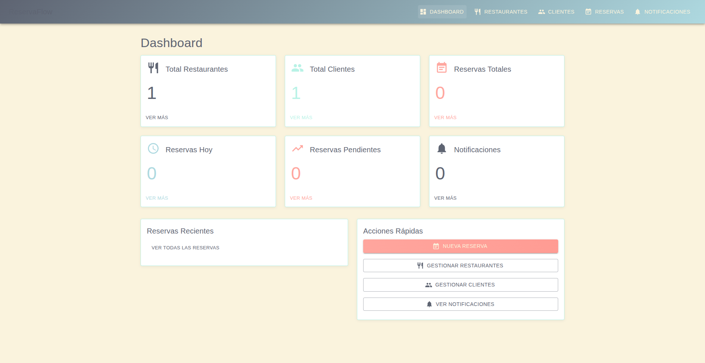
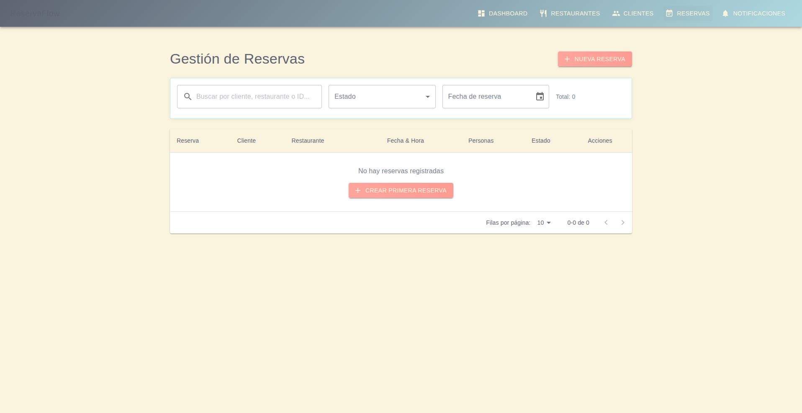
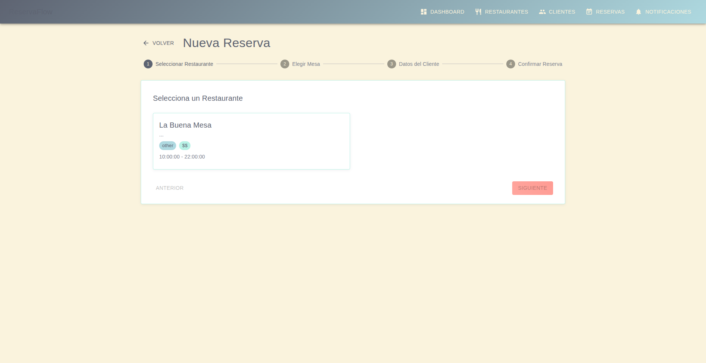
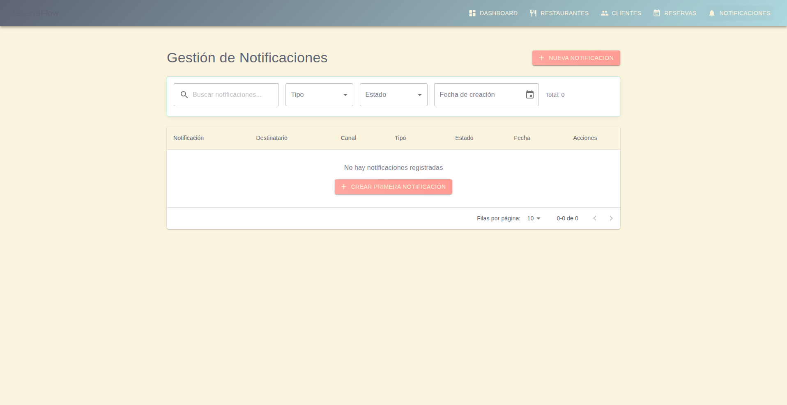

# 🍽️ ReservaFlow - Sistema de Gestión de Reservas para Restaurantes

[](https://reactjs.org/)
[](https://djangoproject.com/)
[](https://python.org/)
[](https://nodejs.org/)
[](https://docker.com/)

ReservaFlow es un sistema completo de gestión de reservas para restaurantes desarrollado con Django REST Framework en el backend y React con Material-UI en el frontend. El sistema permite la gestión integral de restaurantes, clientes, reservas y notificaciones con una interfaz moderna y responsiva.

## 📸 Capturas de Pantalla

### Dashboard Principal

*Vista principal con estadísticas y acciones rápidas*

### Gestión de Restaurantes

*Lista completa de restaurantes con filtros y acciones*

### Gestión de Clientes

*Sistema de gestión de clientes con información detallada*

### Gestión de Reservas

*Panel de control de reservas con filtros avanzados*

### Formulario de Nueva Reserva

*Flujo intuitivo de creación de reservas paso a paso*

### Sistema de Notificaciones

*Centro de control de notificaciones y comunicaciones*

## 🌟 Características Principales

### 🏢 Backend (Django REST Framework)
- **API REST completa** con endpoints para todas las entidades
- **Sistema de reservas** con prevención de doble reserva
- **Gestión de restaurantes y mesas** con disponibilidad en tiempo real  
- **Sistema de notificaciones** con Celery y Redis
- **Autenticación y autorización** configurable
- **Base de datos PostgreSQL** con migraciones automáticas
- **Documentación automática** con Django REST Framework
- **Tests exhaustivos** con pytest y Django TestCase

### 🖥️ Frontend (React + Material-UI)
- **Interfaz responsiva** con Material-UI Design System
- **Dashboard interactivo** con estadísticas en tiempo real
- **CRUD completo** para todas las entidades
- **Gestión de reservas** con flujo de múltiples pasos
- **Sistema de notificaciones** integrado
- **React Query** para gestión de estado y cacheo
- **Routing dinámico** con React Router
- **Tests automatizados** con Jest y Testing Library

### 🔧 Infraestructura
- **Docker Compose** para desarrollo local
- **PostgreSQL** como base de datos principal
- **Redis** para cache y broker de Celery
- **Celery** para tareas asíncronas
- **Nginx** ready para producción

## 🚀 Inicio Rápido

### Prerrequisitos
- Docker y Docker Compose
- Node.js 18+ y npm
- Git

### 1. Clonar el Repositorio
```bash
git clone https://github.com/tu-usuario/ReservaFlow.git
cd ReservaFlow
```

### 2. Configurar Variables de Entorno
```bash
# Backend
cp restaurant-reservations/.env.example restaurant-reservations/.env
# Editar las variables según sea necesario
```

### 3. Iniciar el Backend
```bash
cd restaurant-reservations
docker-compose up -d --build
```

### 4. Iniciar el Frontend
```bash
cd FrontendReact
npm install
npm start
```

### 5. Acceder a la Aplicación
- **Frontend**: http://localhost:3000
- **Backend API**: http://localhost:8000
- **Admin Django**: http://localhost:8000/admin

## 📁 Estructura del Proyecto

```
ReservaFlow/
├── 📂 restaurant-reservations/          # Backend Django
│   ├── 📂 config/                      # Configuración del proyecto
│   ├── 📂 restaurants/                 # App de restaurantes y mesas
│   ├── 📂 customers/                   # App de clientes
│   ├── 📂 reservations/                # App de reservas
│   ├── 📂 notifications/               # App de notificaciones
│   ├── 📂 tests/                       # Tests del backend
│   ├── 📄 docker-compose.yml           # Configuración Docker
│   ├── 📄 requirements.txt             # Dependencias Python
│   └── 📄 manage.py                    # Django management
│
├── 📂 FrontendReact/                   # Frontend React
│   ├── 📂 src/
│   │   ├── 📂 components/              # Componentes reutilizables
│   │   ├── 📂 pages/                   # Páginas principales
│   │   ├── 📂 services/                # API services
│   │   ├── 📄 App.js                   # Componente principal
│   │   └── 📄 index.js                 # Punto de entrada
│   ├── 📂 public/                      # Archivos públicos
│   ├── 📄 package.json                 # Dependencias Node.js
│   └── 📄 README.md                    # Documentación frontend
│
├── 📂 scripts/                         # Scripts de automatización
├── 📂 docs/                           # Documentación adicional
├── 📄 README.md                       # Este archivo
└── 📄 CLAUDE.md                       # Instrucciones para Claude Code
```

## 🔧 Comandos de Desarrollo

### Backend Django
```bash
cd restaurant-reservations

# Iniciar servicios
docker-compose up -d

# Ver logs
docker-compose logs -f web

# Ejecutar migraciones
docker-compose exec web python manage.py migrate

# Crear superusuario
docker-compose exec web python manage.py createsuperuser

# Ejecutar tests
docker-compose exec web uv run pytest -v

# Acceder al shell de Django
docker-compose exec web python manage.py shell

# Parar servicios
docker-compose down
```

### Frontend React
```bash
cd FrontendReact

# Instalar dependencias
npm install

# Iniciar servidor de desarrollo
npm start

# Ejecutar tests
npm test

# Build para producción
npm run build

# Linting
npm run lint (si está configurado)
```

## 🧪 Testing

### Backend Tests
```bash
cd restaurant-reservations

# Todos los tests
docker-compose exec web uv run pytest -v

# Tests específicos
docker-compose exec web uv run pytest tests/unit/ -v
docker-compose exec web uv run pytest tests/integration/ -v

# Tests con cobertura
docker-compose exec web uv run pytest --cov=. --cov-report=html
```

### Frontend Tests
```bash
cd FrontendReact

# Ejecutar todos los tests
npm test -- --watchAll=false

# Tests con cobertura
npm test -- --coverage --watchAll=false

# Tests en modo watch
npm test
```

## 🌐 API Endpoints

### Principales Endpoints
- **Restaurantes**: `GET|POST /api/restaurants/restaurants/`
- **Mesas**: `GET|POST /api/restaurants/tables/`
- **Clientes**: `GET|POST /api/customers/`
- **Reservas**: `GET|POST /api/reservations/`
- **Notificaciones**: `GET|POST /api/notifications/notifications/`

### Documentación API
- **Swagger**: http://localhost:8000/swagger/
- **ReDoc**: http://localhost:8000/redoc/

## 🎨 Tema y Colores

El frontend utiliza una paleta de colores personalizada:
- **Melon**: #ffa69e (Primario)
- **Eggshell**: #faf3dd (Fondo claro)
- **Celeste**: #b8f2e6 (Secundario)
- **Light Blue**: #aed9e0 (Terciario)
- **Paynes Gray**: #5e6472 (Texto)

## 🔐 Configuración de Seguridad

### Desarrollo
- Las APIs están configuradas con `AllowAny` para desarrollo
- CORS habilitado para localhost:3000
- Debug mode activado

### Producción
Actualizar la configuración en `restaurant-reservations/config/settings.py`:
```python
DEBUG = False
ALLOWED_HOSTS = ['tu-dominio.com']
CORS_ALLOW_ALL_ORIGINS = False
CORS_ALLOWED_ORIGINS = ['https://tu-frontend.com']
```

## 📦 Dependencias Principales

### Backend
- **Django 5.2.5**: Framework web
- **Django REST Framework**: API REST
- **PostgreSQL**: Base de datos
- **Redis**: Cache y broker
- **Celery**: Tareas asíncronas
- **pytest**: Testing
- **uv**: Gestión de dependencias

### Frontend
- **React 18.2.0**: Biblioteca de UI
- **Material-UI 5.15.0**: Design system
- **React Query 3.39.3**: Estado y cacheo
- **React Router 6.20.1**: Routing
- **Axios 1.6.2**: Cliente HTTP
- **date-fns**: Manejo de fechas

## 🚀 Despliegue

### Docker Production
```bash
# Build para producción
docker-compose -f docker-compose.prod.yml up -d --build
```

### Configuraciones de Entorno
- **Desarrollo**: Docker Compose local
- **Testing**: GitHub Actions / CI/CD
- **Producción**: Docker Swarm / Kubernetes

## 🤝 Contribución

1. Fork el proyecto
2. Crear rama feature (`git checkout -b feature/nueva-caracteristica`)
3. Commit cambios (`git commit -m 'Agregar nueva característica'`)
4. Push a la rama (`git push origin feature/nueva-caracteristica`)
5. Abrir Pull Request

## 📈 Monitoreo y Logs

### Logs de Aplicación
```bash
# Backend logs
docker-compose logs -f web

# Celery logs
docker-compose logs -f celery-worker

# Database logs
docker-compose logs -f db
```

### Métricas de Celery
- Disponibles en: http://localhost:8000/api/monitoring/celery/health/
- Dashboard de tareas en desarrollo

## 🐛 Troubleshooting

### Problemas Comunes

**Puerto ocupado**:
```bash
# Cambiar puertos en docker-compose.yml
ports:
  - "8001:8000"  # En lugar de 8000:8000
```

**Base de datos no conecta**:
```bash
# Reiniciar servicios
docker-compose down
docker-compose up -d
```

**Frontend no carga**:
```bash
# Limpiar cache y reinstalar
rm -rf node_modules package-lock.json
npm install
npm start
```

## 📄 Licencia

Este proyecto está bajo la Licencia MIT. Ver el archivo `LICENSE` para más detalles.

## 👥 Equipo

- **Desarrollo**: Claude Code Assistant
- **Arquitectura**: Full Stack Django + React
- **Infraestructura**: Docker + PostgreSQL + Redis

## 📞 Soporte

- **Issues**: GitHub Issues
- **Documentación**: `/docs` directorio
- **API Docs**: http://localhost:8000/swagger/

---

⭐ **¡Dale una estrella si te gusta el proyecto!**

Desarrollado con ❤️ usando Django, React, y las mejores prácticas de desarrollo moderno.