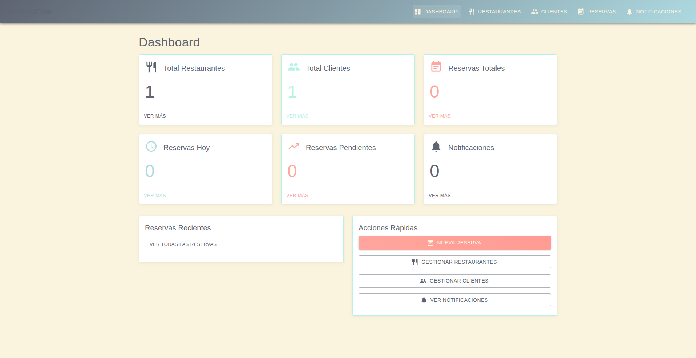
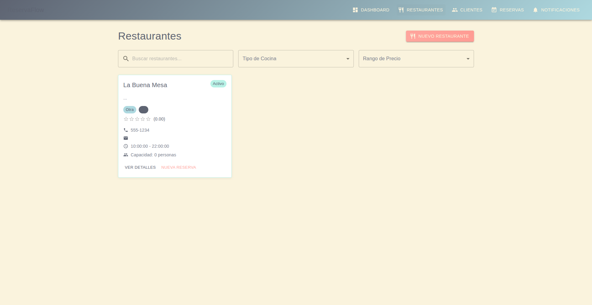
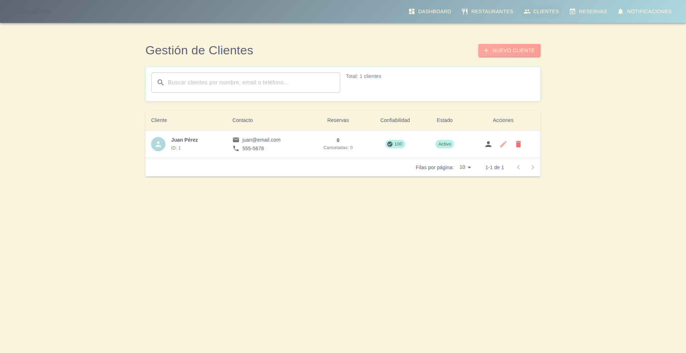
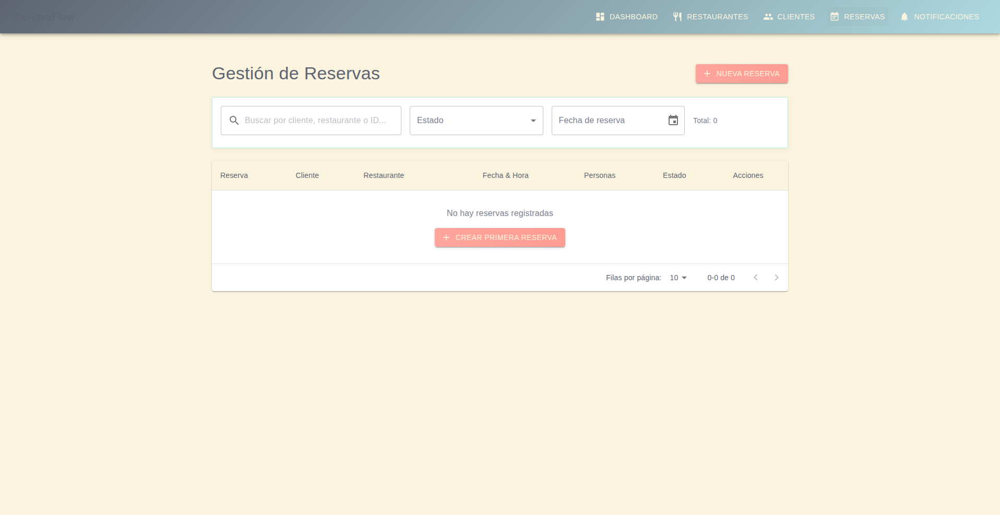
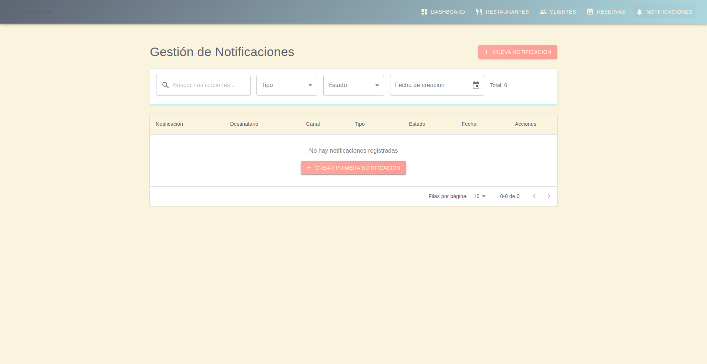

# 📸 ReservaFlow - Galería de Capturas de Pantalla

Esta galería muestra todas las interfaces principales del sistema ReservaFlow, destacando su diseño moderno con Material-UI y la paleta de colores personalizada.

## 🎨 Paleta de Colores

- **Melon** `#ffa69e` - Color primario para elementos principales
- **Eggshell** `#faf3dd` - Fondo suave y agradable
- **Celeste** `#b8f2e6` - Color secundario para acentos
- **Light Blue** `#aed9e0` - Tonos complementarios
- **Paynes Gray** `#5e6472` - Texto y elementos secundarios

---

## 🏠 Dashboard Principal

**Características destacadas:**
- 📊 **6 tarjetas de estadísticas** con iconos Material Design
- 📈 **Métricas en tiempo real** de restaurantes, clientes y reservas
- 🚀 **Acciones rápidas** para operaciones frecuentes
- 📅 **Panel de reservas recientes** (vacío en este ejemplo)
- 🎨 **Diseño responsive** adaptado a diferentes dispositivos

### Elementos de la interfaz:
- **Navegación lateral** con iconos descriptivos
- **Tarjetas informativas** con colores temáticos
- **Botones de acción** con estilo Material-UI
- **Layout organizado** en cuadrícula responsive

---

## 🏢 Gestión de Restaurantes

**Funcionalidades visibles:**
- 🔍 **Búsqueda avanzada** con filtros por tipo de cocina y precio
- 🏪 **Tarjetas de restaurante** con información completa
- ⭐ **Sistema de calificaciones** con estrellas visuales
- 📞 **Información de contacto** y horarios
- 🎯 **Botones de acción** (Ver detalles, Nueva reserva)

### Información mostrada:
- **Nombre del restaurante** y descripción
- **Estado operativo** (Activo/Inactivo)
- **Tipo de cocina** y rango de precios
- **Calificación promedio** con estrellas
- **Datos de contacto** completos
- **Horarios de operación**
- **Capacidad total** del establecimiento

---

## 👥 Gestión de Clientes

**Características del sistema:**
- 📋 **Tabla completa** con información del cliente
- 🔍 **Búsqueda inteligente** por nombre, email o teléfono
- 📊 **Métricas de confiabilidad** con puntuación sobre 100
- 📈 **Historial de reservas** y cancelaciones
- ⚙️ **Acciones rápidas** (Ver, Editar, Eliminar)

### Datos mostrados:
- **Avatar y nombre completo** del cliente
- **ID único** del sistema
- **Información de contacto** (email y teléfono)
- **Estadísticas de reservas** totales y canceladas
- **Puntuación de confiabilidad** calculada automáticamente
- **Estado del cliente** (Activo/Inactivo)
- **Paginación** configurable

---

## 📅 Gestión de Reservas

**Sistema de reservas completo:**
- 🔍 **Filtros avanzados** por estado, fecha y búsqueda
- 📊 **Vista tabular** organizada y clara
- 📈 **Estado en tiempo real** de las reservas
- ➕ **Creación rápida** de nuevas reservas
- 🎯 **Acciones contextuales** por reserva

### Funcionalidades:
- **Búsqueda múltiple** por cliente, restaurante o ID
- **Filtro por estado** (Pendiente, Confirmada, etc.)
- **Selector de fecha** con calendario integrado
- **Contador total** de registros
- **Paginación** con opciones de filas por página
- **Estado vacío** con llamada a la acción

---

## ✨ Formulario de Nueva Reserva

**Proceso paso a paso:**
- 📝 **4 pasos claramente definidos** con indicadores visuales
- 🏪 **Selección de restaurante** con información detallada
- 🪑 **Elección de mesa** (paso 2)
- 👤 **Datos del cliente** (paso 3)  
- ✅ **Confirmación final** (paso 4)

### Elementos del flujo:
- **Indicadores de progreso** numerados
- **Información completa** del restaurante seleccionado
- **Navegación intuitiva** con botones Anterior/Siguiente
- **Validación en tiempo real** de disponibilidad
- **Diseño responsive** adaptado a móviles

---

## 🔔 Sistema de Notificaciones

**Centro de comunicaciones:**
- 📧 **Gestión completa** de notificaciones
- 🔍 **Filtros especializados** por tipo, estado y fecha
- 📊 **Vista tabular** con información detallada
- 📈 **Estadísticas** de notificaciones enviadas
- ⚙️ **Controles de administración**

### Capacidades:
- **Búsqueda de notificaciones** por contenido
- **Filtro por tipo** (Confirmación, Recordatorio, etc.)
- **Filtro por estado** (Enviada, Pendiente, Error)
- **Selector de fecha** para rangos temporales
- **Creación manual** de notificaciones
- **Estado vacío** con sugerencia de primera acción

---

## 🎯 Características de UX/UI

### Navegación
- **Sidebar persistente** con iconos Material Design
- **Indicadores de página activa** con resaltado
- **Breadcrumbs** para navegación contextual
- **Logo y branding** consistente

### Componentes Comunes
- **Botones Material-UI** con iconos descriptivos
- **Campos de búsqueda** con iconos de lupa
- **Dropdowns** con placeholders claros
- **Tablas responsivas** con paginación
- **Cards** con información estructurada
- **Badges de estado** con colores semánticos

### Estados de la Aplicación
- **Estados vacíos** con ilustraciones y llamadas a la acción
- **Loading states** para operaciones asíncronas
- **Estados de error** con mensajes informativos
- **Feedback visual** para acciones del usuario

### Responsive Design
- **Layout adaptativo** para diferentes tamaños de pantalla
- **Navegación móvil** optimizada
- **Tablas responsivas** con scroll horizontal
- **Formularios adaptados** para touch interfaces

---

## 🔧 Tecnologías Utilizadas

### Frontend
- **React 18.2.0** - Framework principal
- **Material-UI v5** - Sistema de diseño
- **React Router v6** - Navegación
- **React Query** - Gestión de estado
- **Axios** - Cliente HTTP

### Herramientas de Desarrollo
- **Create React App** - Configuración base
- **Jest** - Testing framework
- **React Testing Library** - Testing de componentes
- **ESLint** - Análisis de código
- **Prettier** - Formateo de código

### Diseño
- **Material Design 3** - Principios de diseño
- **Custom Theme** - Paleta de colores personalizada
- **Iconografía Material** - Icons consistentes
- **Typography** - Jerarquía tipográfica clara

---

**📌 Nota**: Todas las capturas de pantalla fueron tomadas del entorno de desarrollo usando MCP (Model Context Protocol) para garantizar autenticidad y actualización con la versión más reciente del sistema.